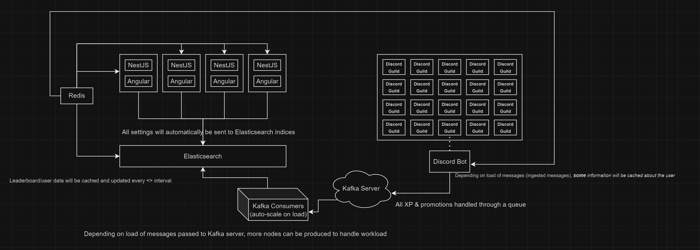

    

<h1 align="center">Harbinger</h1>
Harbinger is an open-source project designed for ROBLOX group owners to manage experience points, user data, and other important metrics efficiently and at a reduced cost. Inspired by Clan Labs, Harbinger goes beyond by providing faster performance, additional customization options, and extended functionality.
 
 
First 500 users in the server get a year of free access!

## Key Features
- **Public API**: Allowing developers and group owners to interact with group data programmatically.
- **Public Interface**: Users can easily view their relevant data through a clean, accessible web page.
- **Discord Bot Integration**: Group owners and members can interact with Harbinger directly in their Discord server via a dedicated bot, making management even more seamless.
- **Open Source**: Complete transparency into how the application functions. Developers and group owners can customize and contribute to the project to fit their specific needs.
- **Future Additions**: New features and capabilities will be added as the application evolves, including integration opportunities and enhanced data management.

Contribute, explore, and make managing your ROBLOX group easier than ever with Harbinger—your efficient and transparent group management tool.

## Trial Customers
We are offering an exclusive opportunity for trial customers to use Harbinger for free—forever! All you need is a willingness to collaborate and provide feedback as the platform evolves. 

If you're interested, simply create a GitHub issue directly in this repository, and we'll get you set up.

Be part of shaping the future of Harbinger while enjoying all its features at no cost!

## How Harbinger Supports You

Harbinger is designed with scalability, performance, and real-time data processing in mind, ensuring that your application needs run efficiently, even under heavy loads. Here’s an overview of the core components that drive the platform and how they are interconnected:

### 1. **Frontend (Angular) and Backend (NestJS) Applications**
   - The Harbinger platform is built with **Angular** for the frontend and **NestJS** for the backend, providing a robust, maintainable, and scalable architecture.
   - Multiple instances of these applications are horizontally scaled to ensure high availability and can handle large amounts of requests. The frontend and backend work together to manage user interactions, provide real-time updates, and handle data requests.

### 2. **Redis for Caching**
   - To minimize response times and avoid frequent database lookups, **Redis** is used for caching leaderboard and user data. This caching layer improves the overall performance by reducing the load on the database and speeding up the retrieval of frequently accessed data, such as XP levels and promotions.
   - Redis is also utilized for storing session data and temporary information needed across multiple components, providing a seamless user experience.

### 3. **Elasticsearch for Real-Time Search and Analytics**
   - **Elasticsearch** indexes all settings and data, allowing for lightning-fast search and real-time analytics. Any updates or changes to user data (e.g., XP, promotions) are indexed into Elasticsearch.
   - This ensures that searches, such as looking up user profiles or retrieving ranking data, are instantaneous even as data scales across multiple users and guilds.

### 4. **Kafka for Message Queuing and Distributed Processing**
   - The system relies on **Apache Kafka** for managing the flow of messages between different services. When users in Discord interact with the bot, Kafka queues and processes messages asynchronously, ensuring smooth handling of large message volumes.
   - **Kafka Consumers** scale automatically based on load, making sure that the application can dynamically handle peaks in user activity without compromising performance.

### 5. **Discord Bot for User Interaction**
   - The **Discord Bot** communicates directly with multiple Discord guilds, capturing messages and user interactions in real-time. It handles all XP tracking, promotion updates, and user management directly within Discord.
   - As users engage with the bot, messages are passed to Kafka and processed asynchronously, ensuring the system can handle thousands of messages efficiently.

### 6. **Auto-Scaling for High Load**
   - Based on message load or user activity, the **Kafka Consumers** and **NestJS/Angular instances** auto-scale to meet the demand. This elasticity ensures that Harbinger can serve hundreds of thousands of users without downtime or slowdowns.

---

This infrastructure ensures that Harbinger is fast, reliable, and scalable, supporting Discord guilds of any size with real-time data handling and seamless integration.

# Developmental Environment

# Credits

# Disclaimer

# Terms